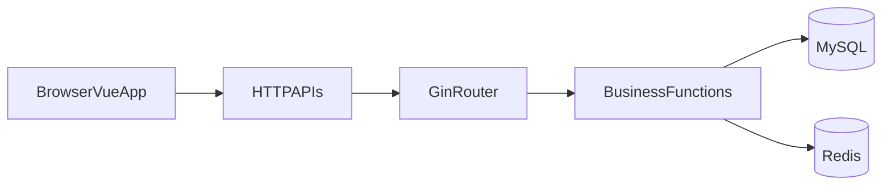

# 现状审计（audit-current-architecture）

## 现有系统结构结论

- 后端是 Gin + GORM + Redis 的单体应用，业务层与数据层耦合。
- 前端是 Vue3 + Vite + Pinia，已有 API 分层但契约管理弱。
- 前后端接口存在 method/字段不一致，容易引发线上 correctness 问题。

## 主要问题清单

### Correctness

1. 部分接口前端使用 POST，后端仅注册 GET。
2. 若干 handler 读取 query/body 字段不一致，导致查询条件失效。
3. 中间件流程控制分支不完整，存在继续执行风险。

### 性能

1. 文章列表存在 N+1 查询模式。
2. 配置项获取多次串行查询。
3. 前端长列表缺少虚拟化，滚动场景渲染成本高。

### 契约

1. 返回结构未彻底统一，错误处理风格分散。
2. TS 类型与后端模型出现漂移（字段类型不一致）。
3. 缺少 OpenAPI 驱动，接口演进不可控。

## 当前数据交互（简图）

## 结论

2026 重构需先统一契约，再做领域拆分与性能治理，避免“先拆后乱”。
