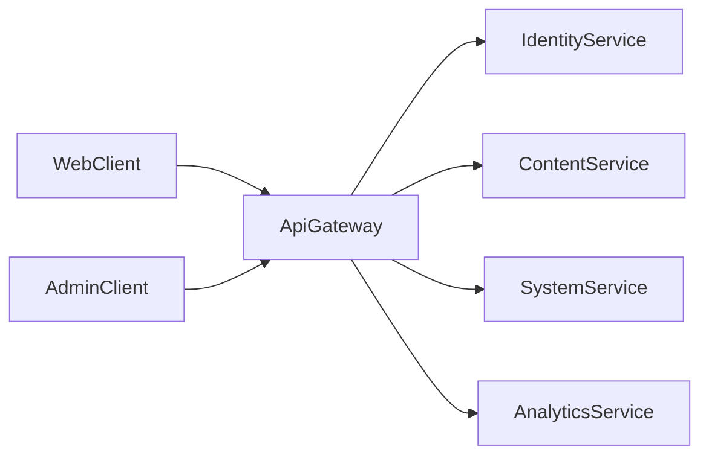

# 架构总览

Painter-2026 按 identity/content/system/analytics 拆分后端域服务，前端分为 web 与 admin 两个应用。

```mermaid
flowchart LR
  webClient[WebClient] --> gateway[ApiGateway]
  adminClient[AdminClient] --> gateway
  gateway --> identitySvc[IdentityService]
  gateway --> contentSvc[ContentService]
  gateway --> systemSvc[SystemService]
  gateway --> analyticsSvc[AnalyticsService]
```

## 服务内分层

- transport/http: 路由与协议处理
- application: 用例编排
- domain: 业务规则
- infrastructure: 存储、缓存、外部依赖
