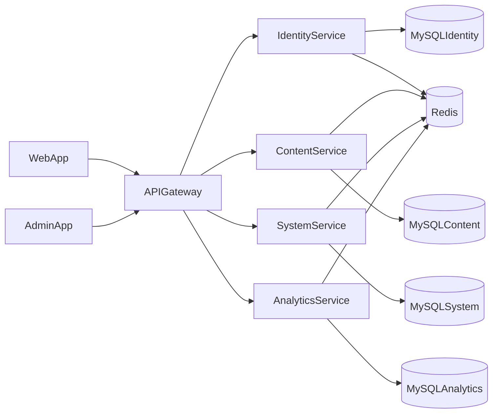

# 目标架构（define-target-architecture）

## 服务边界

- `api-gateway`: 统一入口、鉴权、限流、灰度路由、traceId 注入。
- `identity-service`: 登录、会话、用户、角色、权限矩阵。
- `content-service`: 文章、标签、分类、评论、点赞、收藏。
- `system-service`: 站点设置、字典中心、功能开关、上传策略。
- `analytics-service`: 访问统计、活跃度、聚合报表、异步任务。

## 部署拓扑

## 前端拆分策略

- `apps/web`: 面向访客与内容消费。
- `apps/admin`: 面向运营与配置管理。
- 共用 `packages/sdk-ts` 与统一 UI 规范，保证体验一致。

## 技术规范

- 服务内部分层：`transport -> application -> domain -> infrastructure`
- 统一响应：`{ code, message, data, traceId }`
- 统一错误码：按领域划分段位，保留可观察错误上下文
